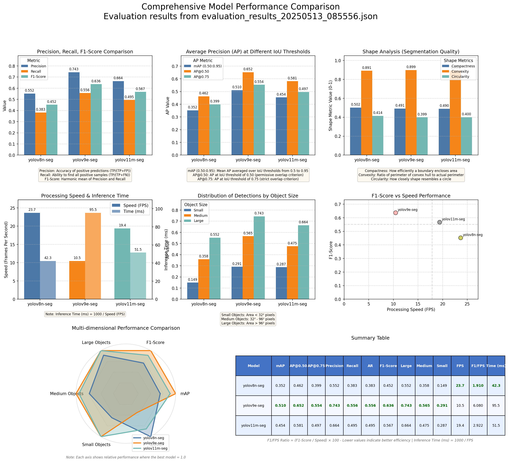

# Task #2 Solution and Deliverables
This project addresses Task #2 "Recognizing Objects in Video Sequences" by:

1. Implementing multiple state-of-the-art object detection and segmentation algorithms
2. Evaluating these algorithms on the COCO dataset for validity, reliability, and objectivity
3. Generating quantitative metrics (mAP, FPS, etc.) and qualitative visualizations
4. Creating demonstration videos showing object positions, shapes, and names

## Key Deliverables
1. **Source Code**: Complete implementation of all components described in this README
2. **Detailed Analysis Report** (`REPORT.md`): Comprehensive qualitative and quantitative analysis of model performance
3. **Demo Videos**: Processed videos demonstrating object recognition capabilities.
    - Example video showcasing the best performing model (YOLOv9e) on `people-detection.mp4`: [https://youtu.be/_EG8Y22zYec](https://youtu.be/_EG8Y22zYec)

    [](https://www.youtube.com/watch?v=_EG8Y22zYec)

4. **Evaluation Results**: JSON files containing raw metrics and comparisons
5. **Metrics Dashboard Example**:
    

The **detailed analysis report** (`REPORT.md`) is a critical deliverable that contains:
- In-depth comparison of model architectures
- Analysis of strengths and weaknesses in different scenarios
- Recommendations for optimal model selection based on use case
- Links to demo videos and supplementary materials
- References to relevant research and methodologies

## Shape Determination and Visualization
Object "shape" is determined and visualized using the instance segmentation masks produced by the models. Unlike bounding box detection, these pixel-precise segmentation masks accurately outline the exact shape of each detected object, enabling more detailed analysis of object morphology, size, and orientation. The segmentation masks create a precise silhouette of objects that follows their actual contours rather than approximating them with rectangles.

## Implemented Models
- YOLOv8 (various sizes)
- YOLOv9 (various sizes)
- YOLO11 (various sizes)

## Available Models for Evaluation

The following model names can be used with the `--models` argument in evaluation scripts (e.g., `src/evaluate_models.py`):

- `yolov8n-seg`
- `yolov8s-seg`
- `yolov8m-seg`
- `yolov8l-seg`
- `yolov8x-seg`
- `yolov9c-seg`
- `yolov9e-seg`
- `yolov11n-seg`
- `yolov11s-seg`
- `yolov11m-seg`
- `yolov11l-seg`
- `yolov11x-seg`

## Reproducing the Full Task #2 Pipeline
To reproduce the complete pipeline for Task #2, follow these steps in order:

```
# Step 1: Ensure environment is set up properly
python -c "import torch; print(f'PyTorch version: {torch.__version__}, CUDA available: {torch.cuda.is_available()}')"

# Step 2: Evaluate models (this will download models and dataset if not present)
# Models updated to yolov9e-seg, yolov11m-seg, and yolov8n-seg
python src/evaluate_models.py --images 200 --models yolov9e-seg yolov11m-seg yolov8n-seg

# Step 3: Generate and display metrics dashboard
python src/generate_dashboard.py --show

# Step 4: Create demo video with best model
python src/create_demo_video.py --best-model

```

**Expected Outputs from Pipeline:**
1. **Step 1**: Verification of PyTorch installation and CUDA availability
2. **Step 2**: 
   - Model weights downloaded to `models/pts/` (first run only)
   - COCO validation images downloaded to `data_sets/image_data/coco/` (first run only)
   - Evaluation results saved to `inference/results/evaluation_results_[timestamp].json`
   - Detection visualizations saved to `inference/results/[model_name]_visualizations/`
3. **Step 3**:
   - Interactive dashboard window
   - Dashboard image saved to `inference/results/dashboard_[timestamp].png`
4. **Step 4**:
   - Demo video processed with best-performing model
   - Output saved to `inference/output_videos/[video_name]_[best_model]_demo.mp4`

The best performing model will be automatically selected based on the evaluation results.

**Execution Time Note:** The full pipeline may take 1-3 hours to run depending on hardware, GPU availability, and number of images processed.
